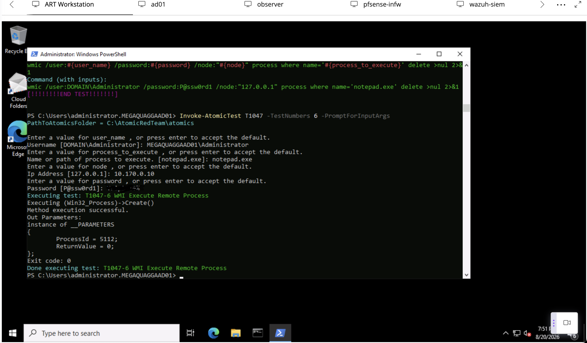
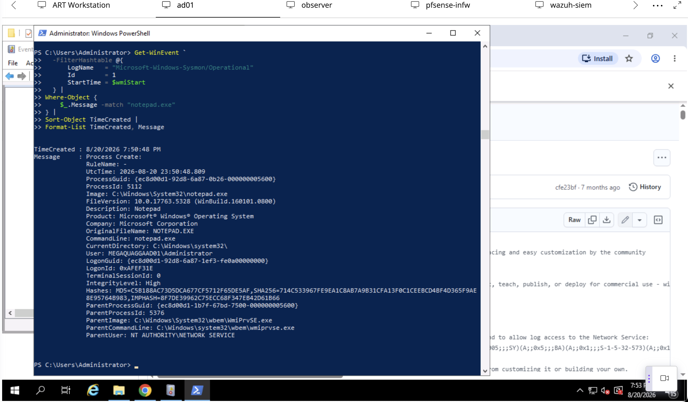
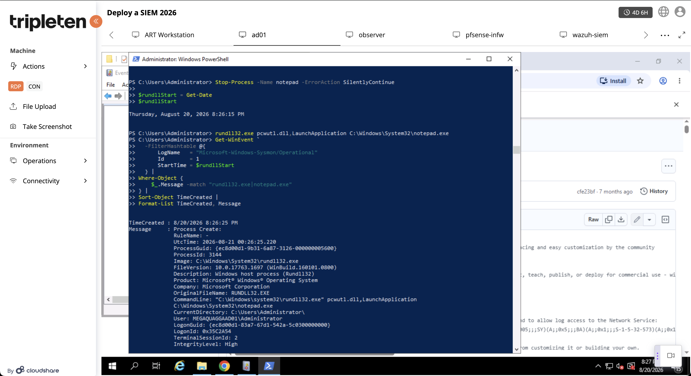
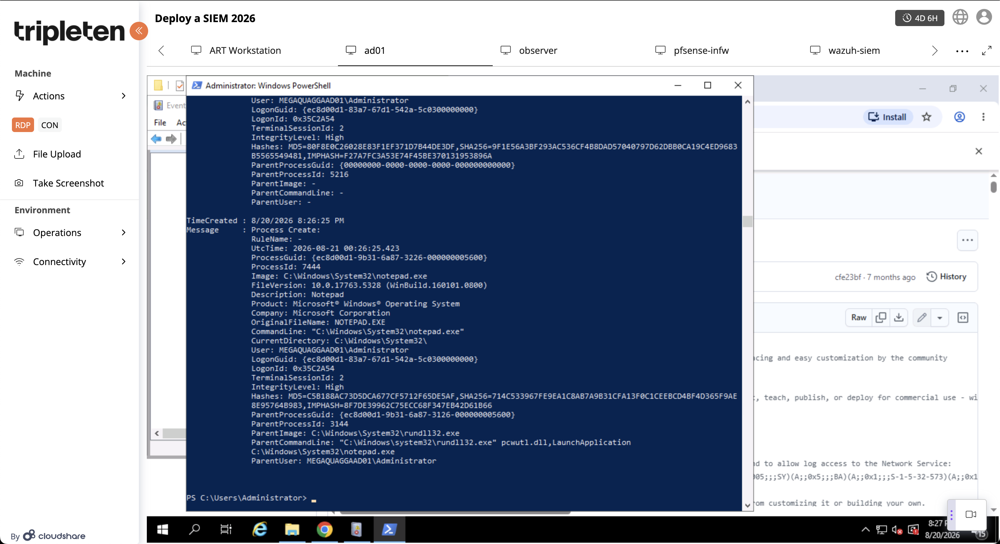
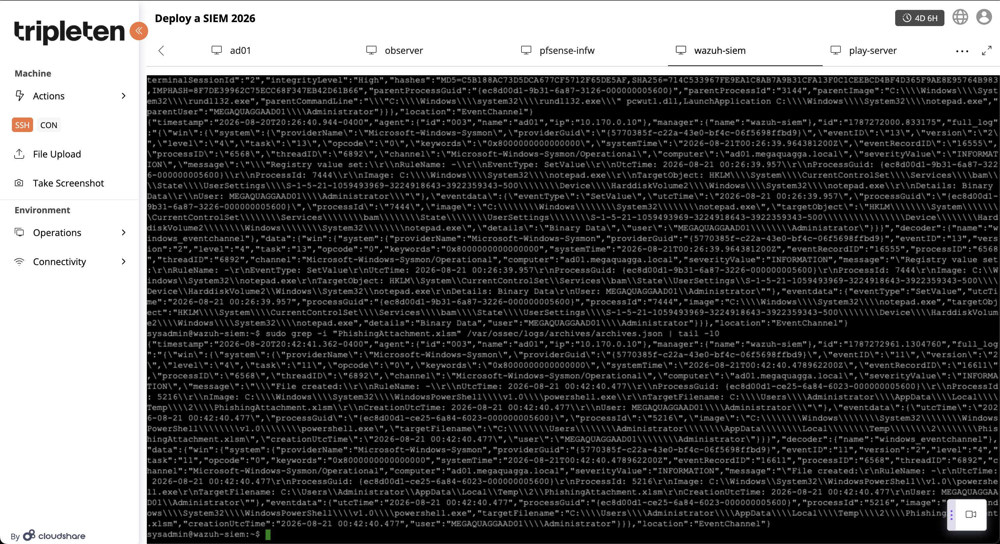

Where Did the Signal Go? Tuning Sysmon and Testing Wazuh with Atomic Red Team

# 1.1 "Teaser" overview
something happening, being logged, reaching the SIEM, and generating an alert are not the same thing. 

# 1.2 Introducing yourself to the cyber community
When I started this project, I thought SIEM work was mainly about collecting logs and finding alerts. I quickly learned that an event can happen, be recorded by Sysmon, reach Wazuh, and still never become an alert. That made me more interested in the investigative side of cybersecurity—figuring out what happened, where the evidence went, and why. In this project, I tuned Sysmon and tested Wazuh using WMI, Rundll32, and a spearphishing attachment simulation.

For this project, I used `ad01` as my monitored Windows system, with Sysmon sending telemetry to Wazuh. Before changing anything, I reviewed the existing Sysmon logs to see which events were creating the most noise. Event ID 10, ProcessAccess, stood out because one pattern appeared repeatedly:

NCPA → lsass.exe → GrantedAccess 0x1000

Instead of excluding NCPA or LSASS completely, I wanted to make a very specific change. I backed up my Sysmon configuration and added a rule that excluded only this exact combination:

Source: C:\Program Files\Nagios\NCPA\ncpa.exe

Target: C:\Windows\system32\lsass.exe

GrantedAccess: 0x1000

Before applying the change, I validated the XML and then updated Sysmon with:

& "C:\Windows\Sysmon64.exe" -c $config

Afterward, the repeated `NCPA → LSASS → 0x1000` events disappeared, while other ProcessAccess activity, including `NCPA → LSASS → 0x1410`, was still visible. That confirmed that I had reduced unnecessary noise without removing all telemetry related to those processes.

One mistake I made during setup was assuming that if I could not find an event in Wazuh alerts, then Wazuh had not received it. I tested this with Notepad and confirmed that Sysmon logged the process locally, but I could not find it in the alert data.

After troubleshooting, I learned that **an event being collected and an event becoming an alert are not the same thing**. I also discovered that Wazuh JSON archives and Filebeat archive forwarding were disabled.

Once I enabled the archives, I was able to confirm that Wazuh was receiving the raw telemetry. That became one of the biggest lessons from my setup: **“No alert” does not always mean “no event.”**

# Experiment #1
I ran Atomic Red Team T1047 Test #6 from the ART Workstation against `ad01`. The test successfully created `notepad.exe` remotely using WMI and returned **Process ID 5112** with a **ReturnValue of 0**.

On `ad01`, Sysmon Event ID 1 recorded `notepad.exe` with the same **Process ID 5112**. Sysmon also identified `C:\Windows\System32\wbem\WmiPrvSE.exe` as the parent process. I then searched Wazuh's `archives.json` and found the same event, including PID 5112 and `WmiPrvSE.exe` as the parent.

This gave me a complete evidence chain from the Atomic test, to Sysmon, and finally to Wazuh. It showed me that the useful part of WMI telemetry is not simply seeing WMI running, but understanding what process it caused to execute.

# Experiment #2
For my second experiment, I tested **T1218.011 — Rundll32** to see whether Sysmon could capture a suspicious parent-child process relationship. On `ad01`, I used Rundll32 to launch Notepad with:

rundll32.exe pcwutl.dll,LaunchApplication C:\Windows\System32\notepad.exe

Sysmon Event ID 1 recorded `rundll32.exe` with **Process ID 3144**. A second Event ID 1 recorded `notepad.exe` with **Parent Process ID 3144**. Even better, Rundll32's ProcessGUID exactly matched Notepad's ParentProcessGUID, giving me direct proof that Rundll32 launched Notepad.

I then checked Wazuh's `archives.json` and found the same Notepad event with `rundll32.exe` preserved as the parent process and the full `pcwutl.dll,LaunchApplication` command line.

This experiment showed me how process relationships can tell a much clearer story than simply seeing an executable name in a log. It also confirmed that my Sysmon tuning had not removed the process-creation telemetry I needed for an investigation. 

# Experiment #3
For my third experiment, I tested **T1566.001 — Spearphishing Attachment**. Because Microsoft Word was not installed on `ad01`, I used the Atomic Red Team test that downloads a macro-enabled Excel file instead of opening an Office document.

PowerShell downloaded `PhishingAttachment.xlsm` into the Windows temporary directory. Sysmon recorded the activity as **Event ID 11 — File Create** and showed:

ProcessId: 5216

Image: C:\Windows\System32\WindowsPowerShell\v1.0\powershell.exe

TargetFilename:

C:\Users\Administrator\AppData\Local\Temp\2\PhishingAttachment.xlsm

User: MEGAQUAGGAAD01\Administrator

I then searched Wazuh’s `archives.json` and found the same Event ID 11 from `ad01`, including the PowerShell process and the path to `PhishingAttachment.xlsm`.

The evidence chain was:

PowerShell - PhishingAttachment.xlsm - Sysmon Event ID 11 - Wazuh archives.json

This experiment showed me that useful security evidence does not always require a file to execute. The fact that a suspicious attachment appeared on disk, along with the process that created it, the path, and the user involved, was enough to give me useful investigative context. 

## Mistake I Made During Testing

During testing, I also attempted a remote Scheduled Task experiment. I expected to find Windows and Wazuh events afterward, but nothing appeared. At first, I thought the problem was with logging or Wazuh.

After checking the Atomic Red Team output again, I realized the test itself had failed with `The network path was not found`, meaning the activity I was searching for had never successfully happened. I then verified DNS resolution, ports 135 and 445, and remote Task Scheduler access before reproducing the task manually.

The biggest lesson from this mistake was to **verify that an action actually executed before troubleshooting why the SIEM did not detect it**.

# 4.1 Summary of experimental findings
This project helped me see how different types of Windows activity appear across Sysmon and Wazuh. The WMI experiment showed me how remote execution can be traced through `WmiPrvSE.exe` to the process it creates. The Rundll32 experiment gave me the clearest process chain, with Sysmon showing the relationship between `rundll32.exe` and `notepad.exe`. The spearphishing attachment experiment showed that useful evidence can also come from file creation, even when the file is never opened.

The biggest lesson was that troubleshooting has to happen in the right order. During setup, I learned that **no alert does not necessarily mean no event**. During testing, I also learned not to start troubleshooting the SIEM before confirming that the activity actually executed.

# 4.2 Advice on avoiding mistakes
My advice to anyone repeating this project would be to verify each stage separately: confirm the action happened, check the local logs, confirm the SIEM received the telemetry, and only then investigate whether a detection or alert was generated.  

# 5.1 The coolest thing I learned
The coolest thing I learned during this project was how much of a story can be reconstructed from logs. At first, I was mostly looking at Event IDs as individual pieces of information. By the end, I was looking at relationships between processes, users, command lines, ProcessGUIDs, files, and parent processes. Seeing `rundll32.exe` connect directly to `notepad.exe` through Sysmon made that idea really click for me. 

# 5.2 One piece of advice
The biggest piece of advice I would give another beginner is to **start with the activity, not the alert**. Before assuming the SIEM failed, first confirm the action actually happened. Then check the local logs, confirm the SIEM received the event, and finally determine whether a rule generated an alert. Following that order would have saved me a lot of troubleshooting time during this project. 

# 5.3 My favorite resource
My favorite external resource was **Olaf Hartong’s Sysmon Modular** project. What I liked most was the idea that a Sysmon configuration should not just be copied and left alone. It should be tuned for the environment. That directly influenced the way I handled the repetitive NCPA-to-LSASS activity. Instead of removing an entire process from logging, I filtered only the specific behavior that was creating unnecessary noise. 

# 5.4 Thank you (gratitudes)!
I also want to thank **Olaf Hartong** for making his Sysmon work available to the security community and helping newer analysts understand how to approach telemetry more intentionally. I also want to thank **Florian Roth (Neo23x0)** for his public Sysmon configuration work, which helped me see how experienced defenders think about Windows logging and detection.

This project started as an exercise in deploying and testing a SIEM, but I ended up learning something more important: good security analysis is not just about finding alerts. It is about understanding the evidence behind them.

# 1.
### Sysmon v15.21

**Author:** Mark Russinovich and Thomas Garnier  
**Affiliation:** Microsoft Sysinternals  
**Published:** June 17, 2026  
**Accessed:** August 20, 2026

This was my main reference for understanding Sysmon event logging, especially Process Create and file activity. It also helped me understand how Sysmon can provide detailed process relationships that can later be analyzed by a SIEM. 

# 2.
### Event Logging

**Author:** Wazuh  
**Affiliation:** Wazuh  
**Published:** No publication date listed  
**Accessed:** August 20, 2026

This documentation helped me understand the difference between Wazuh alerts and archived events. It was especially useful when I discovered that `archives.json` could contain events that did not generate alerts and when I enabled `logall_json` and archive forwarding. 

# 3.
### Sysmon Modular — A Sysmon Configuration Repository for Everybody to Customise

**Author:** Olaf Hartong  
**Affiliation:** FalconForce  
**Published:** No original publication date listed; actively maintained  
**Accessed:** August 20, 2026

This was my favorite outside resource during the project. It helped me understand that a Sysmon configuration should be treated as a starting point and tuned for the actual environment, which influenced my decision to narrowly filter the repetitive NCPA-to-LSASS activity instead of excluding an entire process. 

# 4.
### Windows Management Instrumentation — T1047

**Author:** MITRE ATT&CK  
**Affiliation:** The MITRE Corporation  
**Created:** May 31, 2017  
**Last Modified:** May 12, 2026  
**Accessed:** August 20, 2026

I used this resource to understand how WMI can be abused for remote execution. It helped me interpret why seeing `WmiPrvSE.exe` as the parent of the remotely created Notepad process was meaningful during Experiment 1. 

# 5.
### Atomic Red Team — T1047 Windows Management Instrumentation

**Author:** Red Canary / Atomic Red Team contributors  
**Affiliation:** Red Canary  
**Published:** No publication date listed  
**Accessed:** August 20, 2026

I used this resource to select and run **T1047 Test #6 — WMI Execute Remote Process**. It gave me a repeatable way to create known WMI behavior so I could compare the Atomic result with Sysmon and Wazuh telemetry.